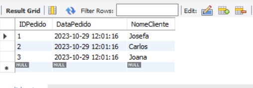
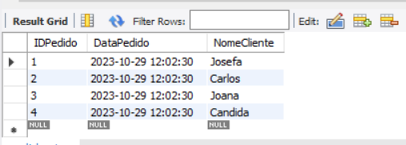
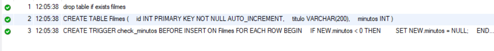
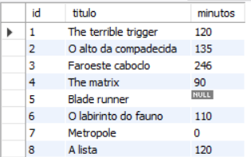
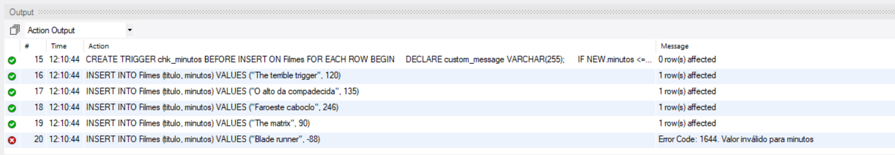
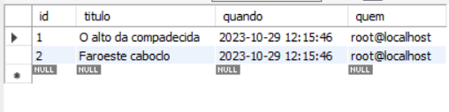

# Atividade individual - Tema: Trigger

## 1. O código cria uma tabela chamada "Pedidos" com três colunas: "IDPedido" (chave primária que se autoincrementa), "DataPedido" (data e hora) e "NomeCliente" (texto). Em seguida, insere três registros com a data e hora atuais e nomes de clientes. Por fim, exibe todos os registros da tabela "Pedidos".

Script SQL:
[SQL](Parte%201%20SQL.sql)

## 2. O código cria uma tabela "Pedidos" com informações sobre pedidos, incluindo um campo para a data do pedido e o nome do cliente. Ele adiciona alguns registros iniciais, insere um gatilho que atualiza automaticamente a data do pedido e, por fim, insere mais um registro e mostra todos os registros na tabela.

Script SQL:
[SQL](Parte%201.1%20SQL.sql)

## 3. O código cria uma tabela chamada "Filmes" com três colunas: "id" (chave primária autoincrementada), "titulo" (texto) e "minutos" (número inteiro). Além disso, define um gatilho "check_minutos" que, antes da inserção, verifica se o valor de "minutos" é menor que zero e o define como NULL se for negativo. Isso evita valores negativos na coluna "minutos" da tabela "Filmes".

Script SQL:
[SQL](Parte%202.1%20SQL.sql)

## 4. O código cria uma tabela "Filmes" com três colunas: "id", "titulo" e "minutos". Em seguida, é definido um gatilho que verifica e substitui valores negativos na coluna "minutos" por NULL durante a inserção de dados. Posteriormente, são inseridos registros na tabela, alguns com valores negativos na coluna "minutos". O gatilho garante que valores negativos sejam substituídos por NULL. Por fim, a tabela é consultada para exibir os registros.

Script SQL:
[SQL](Parte%202.2%20SQL.sql)

## 5. Este código cria uma tabela "Filmes" com três colunas: "id", "titulo" e "minutos". Em seguida, define um gatilho "chk_minutos" que verifica se os valores inseridos na coluna "minutos" são menores ou iguais a zero e, se forem, sinaliza um erro com uma mensagem personalizada. Em seguida, são inseridos registros na tabela "Filmes", alguns dos quais têm valores negativos na coluna "minutos". O gatilho impede a inserção de valores não positivos nessa coluna, exibindo uma mensagem de erro personalizada.

Script SQL:
[SQL](Parte%202.3%20SQL.sql)

## 6. Este código cria uma tabela "Filmes" com três colunas e insere registros nela. Também cria uma tabela "Log_deletions" com quatro colunas. Em seguida, define um gatilho "log_deletions" que registra as exclusões da tabela "Filmes" na tabela "Log_deletions". Dois registros são excluídos na tabela "Filmes". Finalmente, uma consulta SELECT é usada para exibir os registros na tabela "Log_deletions".

Script SQL:
[SQL](Parte%202.4%20SQL.sql)

